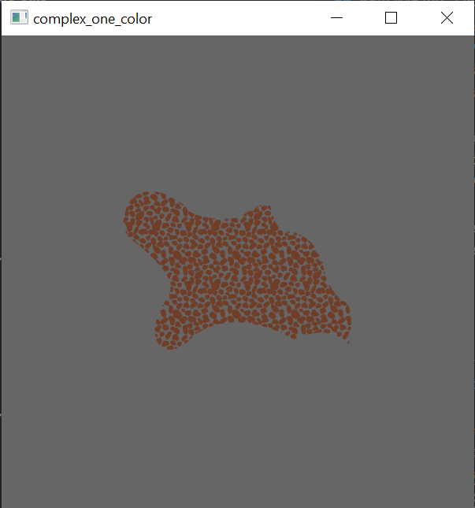

# bevy_svg

For one of my personal projects i needed a way to load and display some simple SVG files/shapes in [`Bevy`],
so i took inspiration from [`bevy_prototype_lyon`] and modified and extended it to...well...load and display
simple SVG files. It currently is rather limited. Ideally, this will change in the future. Currently i use
[`usvg`] to load, parse and simplify an SVG or SVGZ file and afterwards use [`Lyon`] to tessellate and draw
it as a [`Bevy`] mesh. For the color, the first occurance of a color in the file is used as the material
for the resulting mesh, which is why every path on the mesh then has that same color.

In the future i want to change this, maybe use shader to draw the correct color of a [vertex](https://github.com/Weasy666/bevy_svg/blob/master/src/plugin.rs#L39) or doing
some kind of UV magic...dunno, but if someone wants to tackle this, go for it! I will happily accept such a PR,
or PRs in general.
Something else that i want to change, is how i load the SVG file. This would ideally use the Bevy asset manager,
but i didn't have the time to take a deeper look at how it works or how i can integrate with it.

## Examples
### Complex shapes


As you can see, even shapes with complex forms are working.

### Multiple colors


As stated above, multiple colors are currently not working and the color of the last path in the file is used for every path.

## Usage

This crate is not yet on crates.io because it uses Bevy master. But i am planning to publish it as soon as Bevy 0.5 is released.
Until then, you need to copy this to your `Cargo.toml`

```toml
bevy_svg = { git = "https://github.com/Weasy666/bevy_svg" }
```

Then use it like this.

```rust
fn main() {
    App::build()
        .insert_resource(Msaa { samples: 4 })
        .insert_resource(WindowDescriptor {
            title: "SVG Plugin".to_string(),
            ..Default::default()
        })
        .add_plugins(DefaultPlugins)
        .spawn(OrthographicCameraBundle::new_2d())
        .add_plugin(bevy_svg::prelude::SvgPlugin)
        .add_startup_system(svg_drawer.system());
        .run();
}

/// Just a marker.
struct SVG;

fn svg_drawer(commands: &mut Commands) {
    commands.spawn(
        SvgBuilder::from_file("path/to/file.svg")
            .origin(Origin::Center)
            .position(Vec3::new(0.0, 0.0, 0.0))
            .build()
            .expect("File not found")
    )
    .with(SVG);
}
```


[`Bevy`]: https://bevyengine.org
[`bevy_prototype_lyon`]: https://github.com/Nilirad/bevy_prototype_lyon
[`Lyon`]: https://github.com/nical/lyon
[`usvg`]: https://github.com/RazrFalcon/resvg
